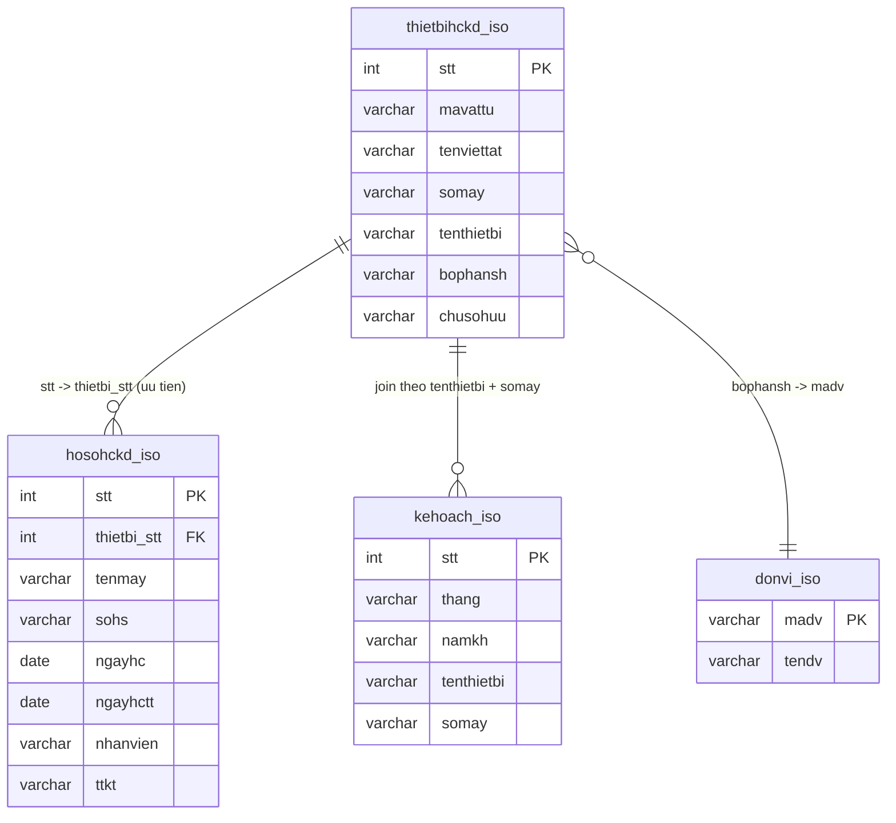
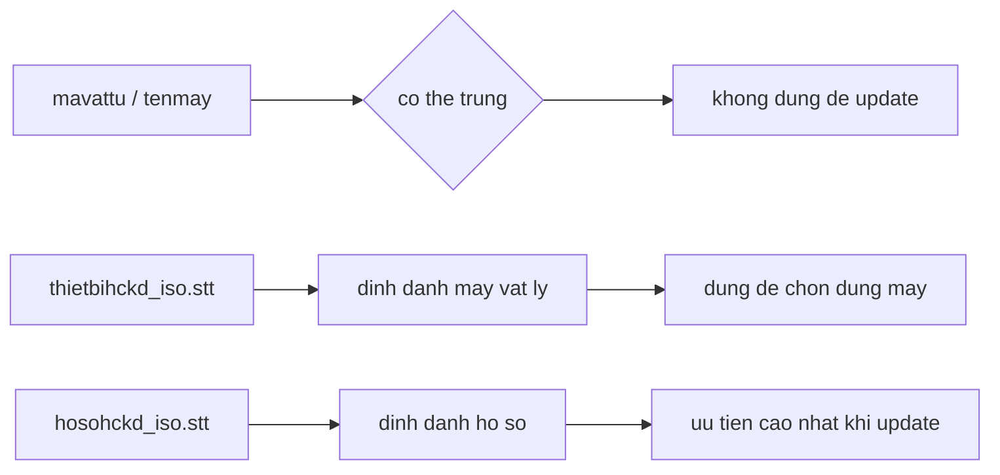
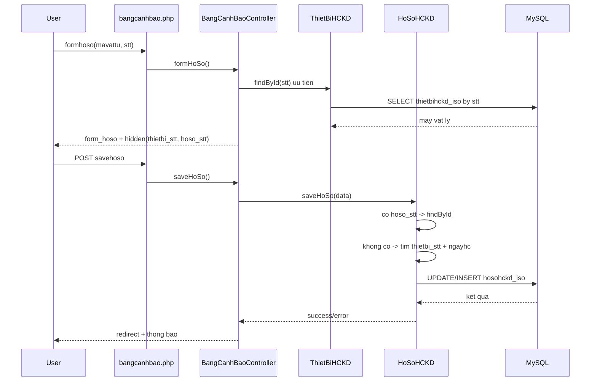
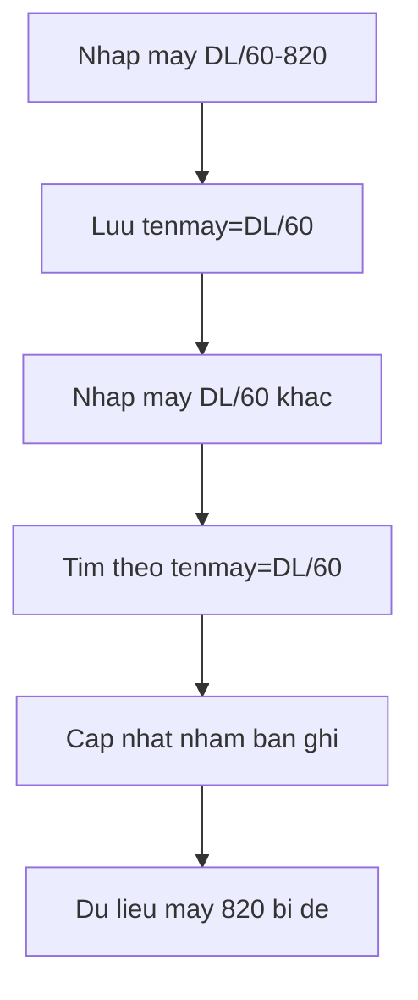

# Bang canh bao - So do hinh anh va ban in A4 (2 mat)

Tai lieu nay duoc dong goi de in 2 mat A4:
- Mat 1: Mo hinh du lieu + mo hinh nhan dang
- Mat 2: Mo hinh xu ly + mo hinh loi ghi de + checklist kiem soat

Huong dan in nhanh:
1. In kho giay A4
2. Chon in 2 mat (flip on long edge)
3. Scale 100% va margin narrow

---

## Mat 1 - Mo hinh du lieu va nhan dang

### 1) So do du lieu (ERD)

### 2) So do nhan dang khoa (Identity Model)

Quy tac chuan:
- Uu tien 1: hoso_stt
- Uu tien 2: thietbi_stt + ngayhc
- Khong update theo mavattu/tenmay don le

---

## Mat 2 - Mo hinh xu ly va kiem soat loi

### 3) So do luong xu ly (Open -> Save)

### 4) So do loi ghi de da gap (Overwrite Model)

### 5) Checklist van hanh truoc khi luu

| Muc kiem | Dat | Khong dat |
|---|---|---|
| Co thietbi_stt trong form | [ ] | [ ] |
| Co hoso_stt khi sua ho so | [ ] | [ ] |
| Khong dung mavattu don le de update | [ ] | [ ] |
| Dieu kien tim ho so la thietbi_stt + ngayhc | [ ] | [ ] |
| Thong bao loi hien ro (khong generic false) | [ ] | [ ] |

### 6) Ket luan

Neu giu dung 3 mo hinh ben tren:
- Data model
- Identity model
- Process model

thi cac may cung model nhu DL/60 se khong con ghi de du lieu len nhau.
