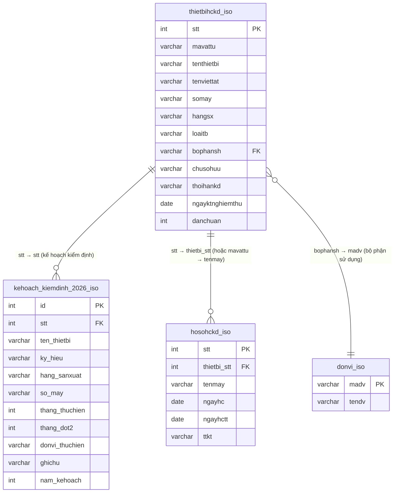

# Quan hệ Cơ sở Dữ liệu: thietbihckd.php & kehoach_thietbi_2026.php

## Sơ đồ quan hệ (ERD)



---

## Mô tả các bảng

### `thietbihckd_iso` — Bảng chính (Master)
Danh mục thiết bị cần hiệu chuẩn / kiểm định.

| Cột | Mô tả |
|-----|-------|
| `stt` | Khóa chính |
| `mavattu` | Mã vật tư (dùng để liên kết dự phòng với `hosohckd_iso.tenmay`) |
| `tenthietbi` | Tên thiết bị |
| `tenviettat` | Ký hiệu / tên viết tắt |
| `somay` | Số máy / serial |
| `hangsx` | Hãng sản xuất |
| `loaitb` | Loại thiết bị |
| `bophansh` | Mã bộ phận sử dụng → FK sang `donvi_iso.madv` |
| `chusohuu` | Chủ sở hữu |
| `thoihankd` | Thời hạn kiểm định (tháng) |
| `ngayktnghiemthu` | Ngày kiểm tra nghiệm thu ban đầu |

---

### `kehoach_kiemdinh_2026_iso` — Kế hoạch kiểm định 2026
Lưu lịch kế hoạch kiểm định theo từng tháng cho từng thiết bị.

| Cột | Mô tả |
|-----|-------|
| `id` | Khóa chính tự tăng |
| `stt` | FK → `thietbihckd_iso.stt` |
| `ten_thietbi` | Sao chép từ master (denormalized) |
| `ky_hieu` | Sao chép từ `tenviettat` |
| `hang_sanxuat` | Sao chép từ `hangsx` |
| `so_may` | Sao chép từ `somay` |
| `thang_thuchien` | Tháng kiểm định chính (1–12) |
| `thang_dot2` | Tháng kiểm định đợt 2 (nếu có) |
| `donvi_thuchien` | Đơn vị thực hiện kiểm định |
| `ghichu` | Ghi chú (chứa mavattu & chủ sở hữu) |
| `nam_kehoach` | Năm kế hoạch (mặc định 2026) |

> **Lưu ý:** Khi lưu kế hoạch, hệ thống **xóa toàn bộ** kế hoạch cũ của thiết bị đó trong năm 2026, sau đó **INSERT lại** một bản ghi cho mỗi tháng được chọn.

---

### `hosohckd_iso` — Hồ sơ hiệu chuẩn / kiểm định thực tế
Lưu lịch sử các lần kiểm định đã thực hiện thực tế.

| Cột | Mô tả |
|-----|-------|
| `stt` | Khóa chính |
| `thietbi_stt` | FK → `thietbihckd_iso.stt` (NULL nếu chưa liên kết trực tiếp) |
| `tenmay` | Dùng để liên kết dự phòng với `thietbihckd_iso.mavattu` |
| `ngayhc` | Ngày hiệu chuẩn / kiểm định (kế hoạch) |
| `ngayhctt` | Ngày hiệu chuẩn thực tế |
| `ttkt` | Tình trạng kết quả kiểm định |

---

### `donvi_iso` — Danh mục đơn vị
Danh sách đơn vị / bộ phận trong tổ chức.

| Cột | Mô tả |
|-----|-------|
| `madv` | Mã đơn vị (khóa chính) |
| `tendv` | Tên đơn vị |

---

## Luồng dữ liệu chính

### Trong `kehoach_thietbi_2026.php`

```
thietbihckd_iso (t)
    ├── LEFT JOIN kehoach_kiemdinh_2026_iso (k) ON t.stt = k.stt AND k.nam_kehoach = 2026
    │       → Lấy tháng kế hoạch, đơn vị thực hiện, tháng đợt 2
    │
    └── LEFT JOIN hosohckd_iso (h) ON h.thietbi_stt = t.stt
                                   OR (h.thietbi_stt IS NULL AND h.tenmay = t.mavattu)
            → Lấy ngày HC gần nhất để tính hạn kiểm định còn lại
```

### Trong `thietbihckd.php`

```
thietbihckd_iso (t)
    ├── LEFT JOIN donvi_iso (dv) ON t.bophansh = dv.madv
    │       → Hiển thị tên bộ phận đầy đủ
    │
    └── LEFT JOIN hosohckd_iso (h) ON h.stt = (
            SELECT stt FROM hosohckd_iso
            WHERE thietbi_stt = t.stt OR tenmay = t.mavattu
            ORDER BY ngayhc DESC LIMIT 1
        )
            → Lấy ngày HC gần nhất, tính days_to_expire
```

---

## Quy tắc nghiệp vụ quan trọng

| Quy tắc | Mô tả |
|---------|-------|
| **Liên kết hai cách** | `hosohckd_iso` liên kết với `thietbihckd_iso` qua `thietbi_stt` (ưu tiên) hoặc `tenmay = mavattu` (dự phòng) |
| **Xóa trước khi lưu** | Mỗi lần lưu kế hoạch: xóa hết kế hoạch 2026 của thiết bị đó, rồi INSERT lại |
| **Denormalization** | `kehoach_kiemdinh_2026_iso` sao chép `tenthietbi`, `somay`, `hangsx` từ master để tránh JOIN khi in báo cáo |
| **Tính hạn** | `days_to_expire = DATEDIFF(ngayhc_calc + thoihankd tháng, CURDATE())` trong đó `ngayhc_calc = COALESCE(h.ngayhc, t.ngayktnghiemthu)` |
| **Bộ lọc bộ phận đặc biệt** | Giá trị `__dvl_tonghop__` trong filter bộ phận sẽ lọc các đơn vị CNC, TH, DVLTH cùng lúc |
