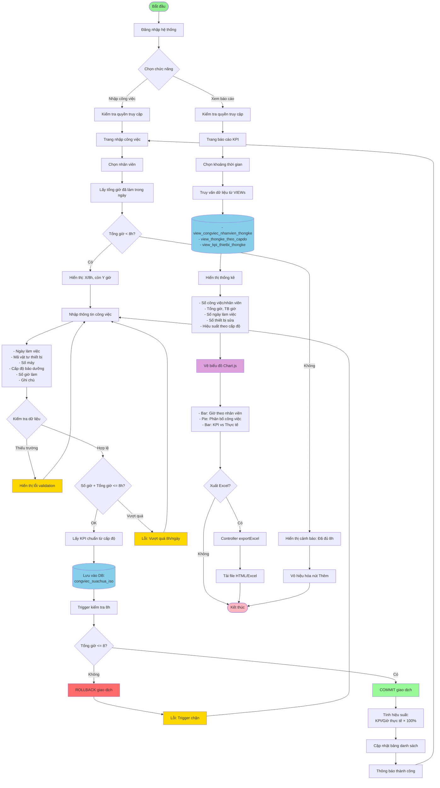
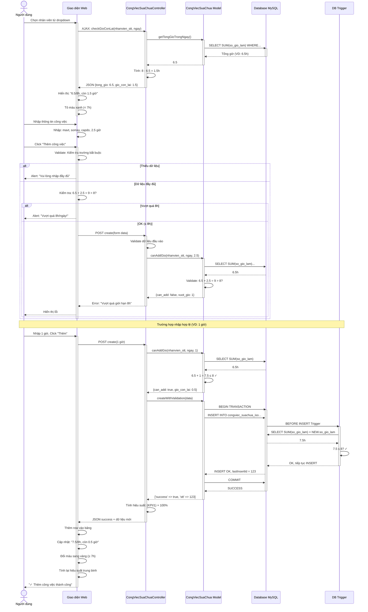
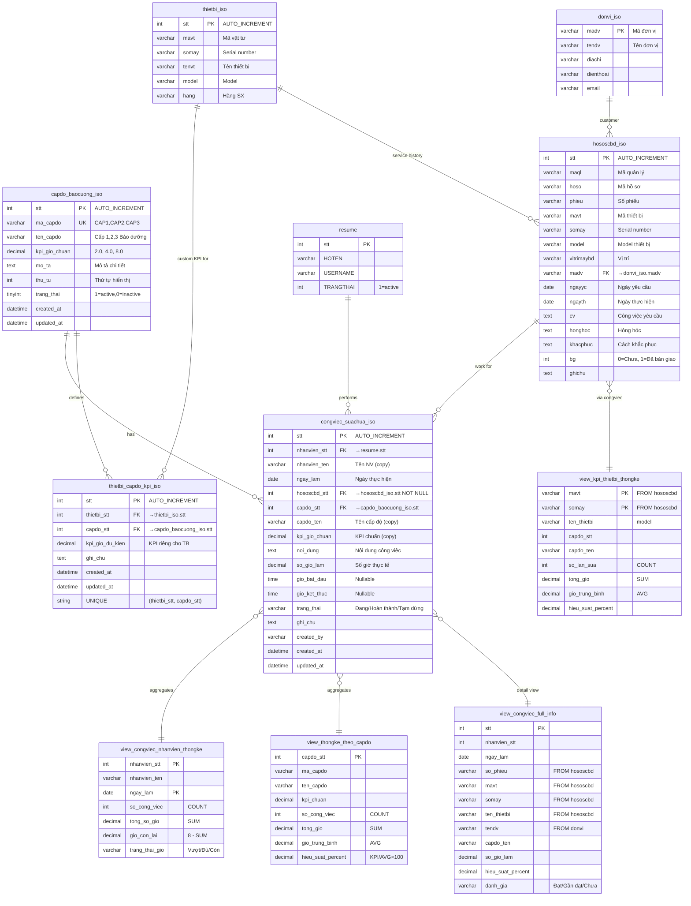

# Lưu đồ - Hệ thống Quản lý Công việc KPI

> Tài liệu mô tả chi tiết chức năng quản lý công việc sửa chữa theo KPI  
> Ngày tạo: 24/02/2026

---

##  1. Lưu đồ Tổng quan Hệ thống

Mô tả luồng hoạt động chính từ đăng nhập đến nhập công việc, xem báo cáo và xuất Excel.



---

## 🔄 2. Sequence Diagram - Quy trình Nhập Công việc

Chi tiết tương tác giữa các thành phần khi nhập công việc mới.



---

## 🗂️ 3. ER Diagram - Cấu trúc Database

Mô tả quan hệ giữa các bảng, VIEWs và khóa ngoại.


    congviec_suachua_iso }o--|| view_kpi_thietbi_thongke : aggregates
```

---

## 🔀 4. State Diagram - Trạng thái Hệ thống

Mô tả các trạng thái và chuyển đổi trong quá trình làm việc.

```mermaid
stateDiagram-v2
    [*] --> ChonNhanVien: Truy cập trang
    
    ChonNhanVien --> KiemTraGio: Chọn nhân viên + ngày
    
    state KiemTraGio {
        [*] --> LayTongGio
        LayTongGio --> TinhGioConLai
        TinhGioConLai --> HienThiTrangThai
        
        state HienThiTrangThai <<choice>>
        HienThiTrangThai --> ConGio: < 8h
        HienThiTrangThai --> DayGio: = 8h
        HienThiTrangThai --> VuotGio: > 8h (lỗi DB)
        
        ConGio --> MauXanh: < 7h
        ConGio --> MauVang: 7h ≤ x < 8h
        
        MauXanh --> [*]: Hiển thị X/8h
        MauVang --> [*]: Hiển thị X/8h
        DayGio --> MauDo: Đủ 8h
        MauDo --> VoHieuHoaNut: Disable thêm
        VoHieuHoaNut --> [*]
    }
    
    KiemTraGio --> NhapThongTin: Còn giờ
    KiemTraGio --> [*]: Đã đủ 8h
    
    NhapThongTin --> ValidationUI: Submit form
    
    state ValidationUI {
        [*] --> KiemTraBatBuoc
        KiemTraBatBuoc --> ThieuDuLieu: Missing fields
        KiemTraBatBuoc --> KiemTraGioNhap: OK
        
        ThieuDuLieu --> [*]: Alert lỗi
        
        KiemTraGioNhap --> VuotQuota: Tổng > 8h
        KiemTraGioNhap --> GuiServer: Tổng ≤ 8h
        
        VuotQuota --> [*]: Alert vượt quá
    }
    
    ValidationUI --> GuiDenController: Validation OK
    ValidationUI --> NhapThongTin: Validation Failed
    
    state GuiDenController {
        [*] --> ControllerValidation
        ControllerValidation --> ModelCanAddGio
        ModelCanAddGio --> CannotAdd: vuot_gio = true
        ModelCanAddGio --> CreateRecord: can_add = true
        
        CannotAdd --> [*]: Return error JSON
        
        state CreateRecord {
            [*] --> BeginTransaction
            BeginTransaction --> InsertSQL
            InsertSQL --> TriggerCheck
            
            state TriggerCheck <<choice>>
            TriggerCheck --> TriggerOK: ≤ 8h
            TriggerCheck --> TriggerFail: > 8h
            
            TriggerFail --> Rollback
            Rollback --> [*]: Lỗi trigger
            
            TriggerOK --> Commit
            Commit --> [*]: Success
        }
        
        CreateRecord --> [*]
    }
    
    GuiDenController --> ThanhCong: Insert OK
    GuiDenController --> ThatBai: Insert Failed
    
    ThanhCong --> CapNhatUI: Return JSON success
    
    state CapNhatUI {
        [*] --> ThemRowMoi
        ThemRowMoi --> TinhHieuSuat
        TinhHieuSuat --> CapNhatTongGio
        CapNhatTongGio --> DoiMauStatus
        DoiMauStatus --> [*]
    }
    
    CapNhatUI --> ChonNhanVien: Tiếp tục nhập
    ThatBai --> NhapThongTin: Hiển thị lỗi
    
    ChonNhanVien --> XemBaoCao: Click "Báo cáo KPI"
    
    state XemBaoCao {
        [*] --> ChonKhoangTG
        ChonKhoangTG --> QueryVIEWs
        
        state QueryVIEWs {
            [*] --> ViewNhanVien
            [*] --> ViewCapDo
            [*] --> ViewThietBi
            
            ViewNhanVien --> [*]
            ViewCapDo --> [*]
            ViewThietBi --> [*]
        }
        
        QueryVIEWs --> TinhToanThongKe
        TinhToanThongKe --> VeBieuDo
        
        state VeBieuDo {
            [*] --> BarChartNhanVien
            [*] --> PieChartCongViec
            [*] --> BarChartKPI
            
            BarChartNhanVien --> [*]
            PieChartCongViec --> [*]
            BarChartKPI --> [*]
        }
        
        VeBieuDo --> HienThiBaoCao
        HienThiBaoCao --> ExportExcel: Click xuất
        HienThiBaoCao --> [*]: Xem tiếp
        
        ExportExcel --> TaiFile
        TaiFile --> [*]
    }
    
    XemBaoCao --> [*]: Kết thúc
    
    note right of KiemTraGio
        Real-time validation:
        - AJAX mỗi khi chọn nhân viên
        - Cập nhật ngay tổng giờ
        - Màu sắc cảnh báo
    end note
    
    note right of GuiDenController
        3 lớp validation:
        1. UI (JavaScript)
        2. Controller (PHP)
        3. Database Trigger
    end note
    
    note right of XemBaoCao
        Thống kê từ VIEWs:
        - Hiệu suất nhân viên
        - So sánh với KPI
        - Phân tích theo cấp độ
    end note
```



---

## 🏗️ 5. Class Diagram - Kiến trúc OOP

Mô tả cấu trúc các class, inheritance và dependencies.

```mermaid
classDiagram
    class BaseModel {
        #PDO $db
        #string $table
        #string $primaryKey
        #array $fillable
        #array $guarded
        __construct(PDO $db)
        +getAll() array
        +find(int $id) array|null
        +create(array $data) string
        +update(int $id, array $data) int
        +delete(int $id) int
        #logActivity(string $action, string $details)
        #filterData(array $data) array
        #executeQuery(string $sql, array $params) PDOStatement
    }
    
    class CongViecSuaChua {
        #string $table "congviec_suachua_iso"
        #string $primaryKey "stt"
        #array $fillable
        +createWithValidation(array $data) array
        +canAddGio(int $nhanvienStt, string $ngay, float $gioMoi) array
        +getTongGioTrongNgay(int $nhanvienStt, string $ngay) float
        +getByNhanVien(int $nhanvienStt, string $ngayBd, string $ngayKt) array
        +getByDateRange(string $ngayBd, string $ngayKt) array
        +updateSoGio(int $stt, float $soGio) bool
        +delete(int $id) int
        -validateRequiredFields(array $data) array
    }
    
    class CapDoBaoCuong {
        #string $table "capdo_baocuong_iso"
        #string $primaryKey "stt"
        #array $fillable
        +getActiveLevels() array
        +getByCode(string $maCapdo) array|null
        +getKPIChuan(int $capdoStt) float
        +getStatistics(string $ngayBd, string $ngayKt) array
        +updateKPI(int $stt, float $kpiGioChuan) bool
        +toggleStatus(int $stt) bool
    }
    
    class ThietBiCapDoKPI {
        #string $table "thietbi_capdo_kpi_iso"
        #string $primaryKey "stt"
        #array $fillable
        +getByThietBi(int $thietbiStt) array
        +getByCapDo(int $capdoStt) array
        +createOrUpdate(array $data) array
        +exists(int $thietbiStt, int $capdoStt) bool
        +delete(int $id) int
        +getKPIDuKien(int $thietbiStt, int $capdoStt) float|null
    }
    
    class Resume {
        #string $table "resume"
        #string $primaryKey "stt"
        +getActiveEmployees() array
        +findByUsername(string $username) array|null
        +getEmployeeInfo(int $stt) array|null
    }
    
    class ThietBi {
        #string $table "thietbi_iso"
        #string $primaryKey "stt"
        +findByMaVtAndSoMay(string $mavt, string $somay) array|null
        +getEquipmentInfo(string $mavt, string $somay) array|null
    }
    
    class CongViecSuaChuaController {
        -PDO $db
        -CongViecSuaChua $congviecModel
        -CapDoBaoCuong $capdoModel
        -ThietBiCapDoKPI $kpiModel
        -Resume $resumeModel
        -ThietBi $thietbiModel
        __construct(PDO $db)
        +index() void
        +create() void
        +update() void
        +delete() void
        +checkGioConLai() void
        +getBaoCaoTongQuan(string $ngayBd, string $ngayKt) array
        +exportExcel(string $ngayBd, string $ngayKt) void
        -validateInput(array $data) array
        -formatResponse(bool $success, string $message, array $data) array
    }
    
    class ViewCongViecNhanVienThongKe {
        <<VIEW>>
        +nhanvien_stt int
        +ten_nhanvien varchar
        +so_cong_viec int
        +tong_gio decimal
        +gio_trung_binh decimal
        +so_ngay_lam int
        +so_thietbi_sua int
    }
    
    class ViewThongKeoCapDo {
        <<VIEW>>
        +capdo_stt int
        +ma_capdo varchar
        +ten_capdo varchar
        +kpi_chuan decimal
        +so_cong_viec int
        +tong_gio decimal
        +gio_trung_binh decimal
        +hieu_suat_percent decimal
    }
    
    class ViewKPIThietBiThongKe {
        <<VIEW>>
        +mavt_thietbi varchar
        +somay_thietbi varchar
        +so_lan_sua int
        +tong_gio decimal
        +so_capdo_khac_nhau int
    }
    
    BaseModel <|-- CongViecSuaChua : extends
    BaseModel <|-- CapDoBaoCuong : extends
    BaseModel <|-- ThietBiCapDoKPI : extends
    BaseModel <|-- Resume : extends
    BaseModel <|-- ThietBi : extends
    
    CongViecSuaChuaController --> CongViecSuaChua : uses
    CongViecSuaChuaController --> CapDoBaoCuong : uses
    CongViecSuaChuaController --> ThietBiCapDoKPI : uses
    CongViecSuaChuaController --> Resume : uses
    CongViecSuaChuaController --> ThietBi : uses
    
    CongViecSuaChua --> CapDoBaoCuong : FK capdo_stt
    CongViecSuaChua --> Resume : FK nhanvien_stt
    ThietBiCapDoKPI --> CapDoBaoCuong : FK capdo_stt
    
    CongViecSuaChua ..> ViewCongViecNhanVienThongKe : aggregates
    CongViecSuaChua ..> ViewThongKeoCapDo : aggregates
    CongViecSuaChua ..> ViewKPIThietBiThongKe : aggregates
    
    note for CongViecSuaChua "Validation rules:\n- nhanvien_stt required\n- ngay_lam_viec required\n- capdo_stt required\n- so_gio_lam > 0\n- Total daily hours ≤ 8"
    
    note for CapDoBaoCuong "KPI Standards:\nCAP1: 2h\nCAP2: 4h\nCAP3: 8h"
    
    note for BaseModel "Base CRUD operations:\n- Auto logging\n- Fillable/guarded protection\n- Return types:\n  create() → string (ID)\n  update() → int (rows)\n  delete() → int (rows)"
```



---

## 🔧 6. Component Diagram - Kiến trúc Tổng thể

Mô tả các lớp (layers) và sự tương tác giữa chúng.

```mermaid
graph TB
    subgraph "Client Layer - Trình duyệt"
        UI[fa:fa-desktop Giao diện Web]
        JS[fa:fa-code JavaScript AJAX]
        Chart[fa:fa-chart-bar Chart.js]
        CSS[fa:fa-paint-brush Tailwind CSS]
    end
    
    subgraph "Presentation Layer - PHP Views"
        ViewIndex[views/congviec/index.php<br/>Form nhập công việc]
        ViewBaoCao[baocao_kpi.php<br/>Dashboard KPI]
        ViewExport[Excel Export View]
    end
    
    subgraph "Application Layer - PHP Controller"
        Router[congviec_suachua.php<br/>Action Router]
        Controller[CongViecSuaChuaController<br/>Business Logic]
        
        Router --> Controller
        
        subgraph "Controller Actions"
            ActIndex[index: Hiển thị form]
            ActCreate[create: Thêm CV]
            ActUpdate[update: Sửa CV]
            ActDelete[delete: Xóa CV]
            ActCheck[checkGioConLai: Validation]
            ActReport[getBaoCaoTongQuan]
            ActExport[exportExcel]
        end
        
        Controller --> ActIndex
        Controller --> ActCreate
        Controller --> ActUpdate
        Controller --> ActDelete
        Controller --> ActCheck
        Controller --> ActReport
        Controller --> ActExport
    end
    
    subgraph "Domain Layer - PHP Models"
        ModelCV[CongViecSuaChua.php]
        ModelCD[CapDoBaoCuong.php]
        ModelKPI[ThietBiCapDoKPI.php]
        ModelNV[Resume.php]
        ModelTB[ThietBi.php]
        ModelBase[BaseModel.php<br/>Abstract Base]
        
        ModelCV -.extends.-> ModelBase
        ModelCD -.extends.-> ModelBase
        ModelKPI -.extends.-> ModelBase
        ModelNV -.extends.-> ModelBase
        ModelTB -.extends.-> ModelBase
    end
    
    subgraph "Data Layer - MySQL Database"
        subgraph "Tables"
            TblCV[(congviec_suachua_iso)]
            TblCD[(capdo_baocuong_iso)]
            TblKPI[(thietbi_capdo_kpi_iso)]
            TblNV[(resume)]
            TblTB[(thietbi_iso)]
        end
        
        subgraph "Views"
            ViewNV[(view_congviec_nhanvien_thongke)]
            ViewCapDo[(view_thongke_theo_capdo)]
            ViewTBKPI[(view_kpi_thietbi_thongke)]
        end
        
        subgraph "Triggers"
            TrigInsert[before_insert_congviec_check_gio]
            TrigUpdate[before_update_congviec_check_gio]
        end
        
        TblCV --> ViewNV
        TblCV --> ViewCapDo
        TblCV --> ViewTBKPI
        
        TblCV -.trigger.-> TrigInsert
        TblCV -.trigger.-> TrigUpdate
        
        TblCV -->|FK capdo_stt| TblCD
        TblCV -->|FK nhanvien_stt| TblNV
        TblKPI -->|FK capdo_stt| TblCD
    end
    
    subgraph "Infrastructure"
        DB[fa:fa-database PDO Connection]
        Auth[requireAuth.php<br/>Session Auth]
        Config[config.php<br/>DB Config]
    end
    
    UI --> JS
    UI --> CSS
    JS --> ViewIndex
    JS --> ViewBaoCao
    
    Chart --> ViewBaoCao
    
    ViewIndex --> Router
    ViewBaoCao --> Router
    
    Router --> Auth
    Auth --> Config
    Config --> DB
    
    Controller --> ModelCV
    Controller --> ModelCD
    Controller --> ModelKPI
    Controller --> ModelNV
    Controller --> ModelTB
    
    ModelBase --> DB
    
    ModelCV --> TblCV
    ModelCD --> TblCD
    ModelKPI --> TblKPI
    ModelNV --> TblNV
    ModelTB --> TblTB
    
    ActReport --> ViewNV
    ActReport --> ViewCapDo
    ActReport --> ViewTBKPI
    
    ActExport --> ViewExport
    
    style UI fill:#E3F2FD
    style ViewIndex fill:#FFF9C4
    style ViewBaoCao fill:#FFF9C4
    style Controller fill:#C8E6C9
    style ModelBase fill:#FFCCBC
    style TblCV fill:#B2DFDB
    style ViewNV fill:#D1C4E9
    style TrigInsert fill:#FFAB91
    style TrigUpdate fill:#FFAB91
    style DB fill:#CFD8DC
    
    classDef controllerAction fill:#A5D6A7,stroke:#4CAF50,stroke-width:2px
    class ActIndex,ActCreate,ActUpdate,ActDelete,ActCheck,ActReport,ActExport controllerAction
```



---

## 📋 Tóm tắt Chức năng

### Quy tắc Nghiệp vụ
- ✅ Mỗi nhân viên tối đa **8 giờ/ngày**
- ✅ 3 cấp độ bảo dưỡng với KPI chuẩn:
  - **CAP1**: 2 giờ
  - **CAP2**: 4 giờ  
  - **CAP3**: 8 giờ
- ✅ Hiệu suất = (KPI chuẩn / Giờ thực tế) × 100%

### Validation 3 Lớp
1. **JavaScript** (Client-side): Validation form trước khi submit
2. **PHP Controller**: Kiểm tra logic nghiệp vụ
3. **Database Trigger**: Đảm bảo tính toàn vẹn dữ liệu

### Màu Cảnh báo
- 🟢 **Xanh**: < 7 giờ (an toàn)
- 🟡 **Vàng**: 7-8 giờ (gần đủ)
- 🔴 **Đỏ**: = 8 giờ (đã đủ, disable thêm)

### Báo cáo Thống kê
- Số công việc, tổng giờ, giờ trung bình theo nhân viên
- So sánh KPI chuẩn vs thực tế theo cấp độ
- Thống kê thiết bị: số lần sửa, tổng giờ
- Export Excel với UTF-8 BOM

---

## 📂 Files Liên quan

```
iso2/
├── migrations/
│   ├── 20260224_create_kpi_suachua_system.sql
│   └── CREATE_thietbi_capdo_kpi_SIMPLE.sql  # FK Migration
├── models/
│   ├── BaseModel.php
│   ├── CongViecSuaChua.php
│   ├── CapDoBaoCuong.php
│   ├── ThietBiCapDoKPI.php
│   ├── Resume.php
│   └── ThietBi.php
├── controllers/
│   └── CongViecSuaChuaController.php
├── views/
│   └── congviec/
│       └── index.php
├── congviec_suachua.php (Router)
├── baocao_kpi.php (Dashboard)
├── CONGVIEC_KPI_README.md
└── LUUDO_CONGVIEC_KPI.md (file này)
```

---

## 🔧 Database Optimization - FK Design

### Thiết kế Cơ sở dữ liệu Tối ưu (2026-02-25)

Bảng `thietbi_capdo_kpi_iso` được tối ưu hóa sử dụng **Foreign Key** thay vì lưu trùng dữ liệu:

**✅ Thiết kế mới (Normalized - 3NF):**
```sql
CREATE TABLE thietbi_capdo_kpi_iso (
    stt INT(11) PRIMARY KEY AUTO_INCREMENT,
    thietbi_stt INT(11) NOT NULL,           -- FK → thietbi_iso.stt
    capdo_stt INT(11) NOT NULL,             -- FK → capdo_baocuong_iso.stt
    kpi_gio_du_kien DECIMAL(5,2),          -- KPI riêng
    ghi_chu TEXT,
    created_at DATETIME DEFAULT CURRENT_TIMESTAMP,
    updated_at DATETIME DEFAULT CURRENT_TIMESTAMP ON UPDATE CURRENT_TIMESTAMP,
    UNIQUE KEY unique_thietbi_capdo (thietbi_stt, capdo_stt),
    INDEX idx_thietbi (thietbi_stt),
    INDEX idx_capdo (capdo_stt)
) ENGINE=InnoDB DEFAULT CHARSET=utf8mb4 COLLATE=utf8mb4_unicode_ci;
```

**❌ Thiết kế cũ (Denormalized):**
```sql
-- varchar mavt VARCHAR(50)      -- 50 bytes
-- varchar somay VARCHAR(50)     -- 50 bytes
-- Tổng: 100 bytes duplication/record
```

### Lợi ích FK Design
1. **Tiết kiệm Storage**: 96 bytes/record (100 bytes → 4 bytes INT)
2. **Referential Integrity**: Đảm bảo thietbi_stt luôn tồn tại trong thietbi_iso
3. **Cascade Operations**: Tự động cập nhật/xóa khi thiết bị thay đổi
4. **Query Performance**: JOIN nhanh hơn với INT index vs VARCHAR
5. **Third Normal Form (3NF)**: Loại bỏ transitive dependency

---

### Tối ưu hóa `congviec_suachua_iso` với `hososcbd_iso` FK (2026-02-25)

**Nguyên tắc nghiệp vụ:**
- Một `hososcbd_iso` (hồ sơ sửa chữa) chỉ có **1 thiết bị** (mavt, somay)
- Công việc sửa chữa **LUÔN liên quan** đến hồ sơ SCBD
- Người dùng **chọn hososcbd_iso** khi nhập công việc → không cần nhập mavt/somay

**✅ Thiết kế mới (Normalized - 3NF):**
```sql
CREATE TABLE congviec_suachua_iso (
    stt INT(11) PRIMARY KEY AUTO_INCREMENT,
    nhanvien_stt INT(11) NOT NULL,
    nhanvien_ten VARCHAR(100),              -- Copy để query nhanh
    ngay_lam DATE NOT NULL,
    
    hososcbd_stt INT(11) NOT NULL,          -- FK → hososcbd_iso.stt (BẮT BUỘC)
    -- Không cần mavt, somay → lấy từ hososcbd_iso
    
    capdo_stt INT(11) NOT NULL,
    capdo_ten VARCHAR(100),                 -- Copy để query nhanh
    kpi_gio_chuan DECIMAL(5,2),
    
    noi_dung TEXT NOT NULL,
    so_gio_lam DECIMAL(5,2) NOT NULL,
    trang_thai VARCHAR(50) DEFAULT 'Đang thực hiện',
    ghi_chu TEXT,
    
    created_by VARCHAR(80),
    created_at DATETIME DEFAULT CURRENT_TIMESTAMP,
    updated_at DATETIME DEFAULT CURRENT_TIMESTAMP ON UPDATE CURRENT_TIMESTAMP,
    
    CONSTRAINT fk_congviec_hososcbd FOREIGN KEY (hososcbd_stt) 
        REFERENCES hososcbd_iso(stt) ON DELETE RESTRICT ON UPDATE CASCADE
) ENGINE=InnoDB;
```

**❌ Thiết kế cũ (Denormalized):**
```sql
-- varchar mavt VARCHAR(80)          -- 80 bytes
-- varchar somay VARCHAR(80)         -- 80 bytes  
-- varchar ten_thietbi VARCHAR(255)  -- 255 bytes
-- int thietbi_stt INT(11)           -- 4 bytes (nullable, không có FK)
-- Tổng: 419 bytes duplication/record
```

**Lợi ích thiết kế mới:**

1. **Tiết kiệm 415 bytes/record** (419 bytes → 4 bytes INT FK)
2. **Referential Integrity**: Không thể nhập công việc cho hồ sơ không tồn tại
3. **Data Consistency**: mavt/somay luôn chính xác (lấy từ hososcbd_iso)
4. **Simplified Input**: Người dùng chỉ chọn hồ sơ → tự động có thiết bị
5. **Third Normal Form (3NF)**: Loại bỏ duplication mavt/somay

**VIEW hỗ trợ - Lấy thông tin đầy đủ:**
```sql
CREATE VIEW view_congviec_full_info AS
SELECT 
    cv.*,
    hs.phieu AS so_phieu,
    hs.maql,
    hs.mavt,              -- Từ hososcbd_iso
    hs.somay,             -- Từ hososcbd_iso
    hs.model AS ten_thietbi,
    hs.vitrimaybd,
    dv.tendv AS ten_donvi
FROM congviec_suachua_iso cv
JOIN hososcbd_iso hs ON cv.hososcbd_stt = hs.stt
LEFT JOIN donvi_iso dv ON hs.madv = dv.madv;
```

**Migration Script:**
- File: `migrations/ALTER_congviec_hososcbd_FK.sql`
- Chức năng: 
  - DROP cột mavt, somay, ten_thietbi, thietbi_stt
  - Thay đổi hososcbd_stt → NOT NULL
  - Thêm FK constraint
  - Cập nhật VIEWs với JOIN hososcbd_iso

---

### Migration Scripts

#### 1. ThietBi CapDo KPI - FK Design
File: `migrations/CREATE_thietbi_capdo_kpi_SIMPLE.sql`

**Cách chạy:**
```bash
mysql -u root -p diavatly_db < migrations/CREATE_thietbi_capdo_kpi_SIMPLE.sql
```

**Script thực hiện:**
1. DROP tất cả bảng liên quan (clean slate)
2. CREATE `capdo_baocuong_iso` + INSERT 3 levels (CAP1, CAP2, CAP3)
3. CREATE `thietbi_capdo_kpi_iso` với FK design
4. VERIFY với SELECT COUNT

#### 2. CongViec SuaChua - hososcbd_iso FK
File: `migrations/ALTER_congviec_hososcbd_FK.sql`

**Cách chạy:**
```bash
mysql -u root -p diavatly_db < migrations/ALTER_congviec_hososcbd_FK.sql
```

**Script thực hiện:**
1. BACKUP bảng hiện tại → `congviec_suachua_iso_backup_20260225`
2. DELETE records không có `hososcbd_stt`
3. DROP các cột: `mavt`, `somay`, `ten_thietbi`, `thietbi_stt`
4. MODIFY `hososcbd_stt` → NOT NULL
5. ADD FK constraint: `hososcbd_stt → hososcbd_iso.stt`
6. CREATE/UPDATE VIEWs:
   - `view_kpi_thietbi_thongke` (JOIN hososcbd_iso)
   - `view_congviec_full_info` (new - thông tin đầy đủ)
7. VERIFY kết quả

---

### Sử dụng trong PHP

#### A. Tạo KPI riêng cho thiết bị

```php
// 1. Tìm thietbi_stt từ mavt/somay
$thietbi = $thietbiModel->findByMaVtAndSoMay('TB001', 'M001');
$thietbiStt = $thietbi['stt'];

// 2. Tạo KPI riêng
$kpiModel->createOrUpdate([
    'thietbi_stt' => $thietbiStt,
    'capdo_stt' => 1,              // CAP1
    'kpi_gio_du_kien' => 3.0,     // 3 giờ thay vì 2 giờ chuẩn
    'ghi_chu' => 'Thiết bị phức tạp hơn'
]);
```

#### B. Nhập công việc sửa chữa (với hososcbd_iso)

```php
// 1. Người dùng chọn hồ sơ SCBD (dropdown/autocomplete)
$hososcbdStt = $_POST['hososcbd_stt'];  // VD: 123

// 2. Lấy thông tin hồ sơ để hiển thị (optional - cho confirmation)
$hososcbd = $hososcbdModel->find($hososcbdStt);
// → có mavt, somay, model, phieu, maql...

// 3. Nhập công việc - CHỈ cần hososcbd_stt
$congviecModel->create([
    'nhanvien_stt' => $nhanvienStt,
    'nhanvien_ten' => $nhanvienTen,
    'ngay_lam' => '2026-02-25',
    
    'hososcbd_stt' => $hososcbdStt,  // ← CHỈ CẦN TRƯỜNG NÀY cho thiết bị
    
    'capdo_stt' => 1,
    'capdo_ten' => 'Bảo dưỡng Cấp 1',
    'kpi_gio_chuan' => 2.00,
    
    'noi_dung' => 'Vệ sinh, bôi trơn, kiểm tra',
    'so_gio_lam' => 2.5,
    'created_by' => $username
]);
```

#### C. Xem công việc với thông tin đầy đủ

```php
// JOIN tự động qua VIEW
$result = $db->query("
    SELECT * FROM view_congviec_full_info
    WHERE nhanvien_stt = 123
      AND ngay_lam = '2026-02-25'
    ORDER BY created_at DESC
");

// Kết quả có đầy đủ:
// - so_phieu, maql, ma_hoso (từ hososcbd)
// - mavt, somay, ten_thietbi (từ hososcbd)
// - tendv (từ donvi)
// - capdo_ten, kpi_gio_chuan
// - so_gio_lam, hieu_suat_percent, danh_gia
```

#### D. Lấy KPI khi nhập công việc
```php
// Ưu tiên KPI riêng, fallback KPI chuẩn
$kpiRieng = $kpiModel->getKPIDuKien($thietbiStt, $capdoStt);
$kpiChuan = $capdoModel->getKPIChuan($capdoStt);
$kpiSuDung = $kpiRieng ?? $kpiChuan;
```

---

**Lưu ý**: Để xem các biểu đồ Mermaid, mở file này bằng:
- VS Code với extension **Markdown Preview Mermaid Support**
- GitHub / GitLab (hỗ trợ Mermaid native)
- Các editor hỗ trợ Mermaid khác
